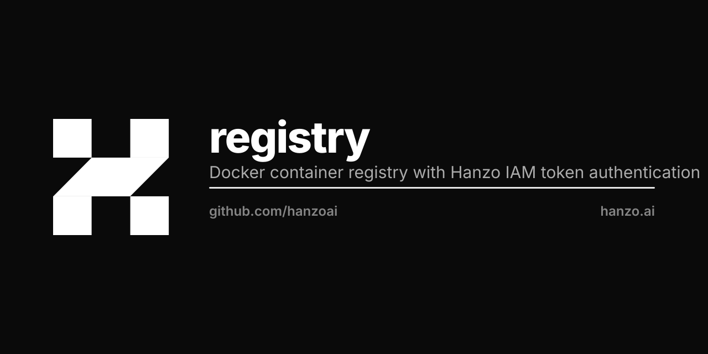

<p align="center"></p>

# Hanzo Registry

**The** container registry for the Lux / Hanzo / Zoo fleet — self-hosted, on our
own boxes, S3-backed. One registry, one way to push and pull images. Escapes
GitHub's GHCR push and Actions-artifact storage quotas.

## Overview

- **Engine**: Docker Distribution (`registry:2`) on hanzo-k8s
- **Auth**: Hanzo IAM token (`https://iam.hanzo.ai/v1/iam/registry/token`, app `hanzo-registry`)
- **Storage**: `hanzoai/s3` (S3 driver → `s3.hanzo.svc:9000`, bucket `registry`,
  path-style). Unlimited, on our own boxes — no PVC ceiling, no GitHub quota.
- **Hosts (branded, one store)**: like `s3.lux.cloud`, a single backing registry
  is served under per-brand hosts that all route to the same Service:
  - `registry.hanzo.ai` — Hanzo images
  - `registry.lux.network` — Lux images
  - `registry.zoo.network` — Zoo images

  Images are org-namespaced: `registry.hanzo.ai/<org>/<app>`. Use the host that
  matches the image's brand (Lux images via `registry.lux.network`, etc.).

## Usage

```bash
docker login registry.hanzo.ai            # Hanzo IAM credentials (or KMS robot)
docker tag  myapp:latest registry.hanzo.ai/hanzo/myapp:latest
docker push registry.hanzo.ai/hanzo/myapp:latest
docker pull registry.hanzo.ai/hanzo/myapp:latest
```

In CI this is automatic: a repo's `hanzo.yml` sets `repo: registry.hanzo.ai/<org>/<app>`
and `hanzoai/ci` logs in with a KMS-provided IAM robot credential. See
[hanzoai/ci](https://github.com/hanzoai/ci).

## Architecture

```
docker push registry.hanzo.ai/<org>/<app>
        │  401 → token realm
        ▼
iam.hanzo.ai/v1/iam/registry/token   (app hanzo-registry, signed JWT)
        │  JWT
        ▼
registry (Distribution, hanzo-k8s)  ── validates JWT vs SIGNING_CRT
        │  blob/manifest writes
        ▼
hanzoai/s3  (s3.hanzo.svc:9000, bucket `registry`)   ← image layers live here
```

## Deploy

```bash
# one-time: provision the S3 bucket in hanzoai/s3
kubectl apply -f k8s/create-bucket-job.yaml

# config + deployment (S3 storage via ConfigMap; creds from the s3-credentials secret)
kubectl apply -f k8s/configmap.yaml -f k8s/deployment.yaml -f k8s/service.yaml
kubectl -n hanzo rollout status deploy/registry
```

`config.yml` is the source of truth and ships as the `registry-config` ConfigMap
(mounted over the image default — no image rebuild to change storage/auth).

## Structure

```
config.yml                  # source of truth (S3 storage + IAM token auth)
k8s/
  configmap.yaml            # config.yml as a mounted ConfigMap
  deployment.yaml           # registry:2; S3 creds from the s3-credentials secret
  service.yaml              # ClusterIP :5000
  create-bucket-job.yaml    # one-time: mc mb s3/registry
```

## Credentials (no secrets in this repo)

- **S3 backend**: `REGISTRY_STORAGE_S3_ACCESSKEY`/`SECRETKEY` from the
  `s3-credentials` secret (the same canonical s3 root secret the `s3` deploy
  uses). Non-secret S3 config (endpoint/bucket/path-style) is in `config.yml`.
- **Token signing**: `registry-signing-key` secret, key `SIGNING_CRT`, mounted
  at `/etc/registry-signing/signing.crt`.
- **Push from CI / clients**: an IAM robot for app `hanzo-registry`, distributed
  via KMS — never checked in.
